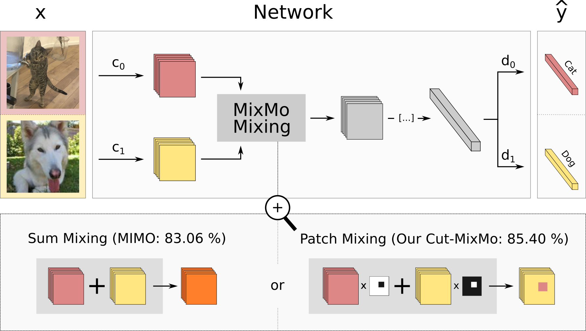

# MixMo: Mixing Multiple Inputs for Multiple Outputs via Deep Subnetworks

Official Pytorch implementation of the MixMo framework | [paper](https://arxiv.org/abs/2103.06132)

[Alexandre Ramé](https://alexrame.github.io/), [Rémy Sun](http://perso.eleves.ens-rennes.fr/people/remy.sun/), [Matthieu Cord](http://webia.lip6.fr/~cord/)



## Citation

If you find this code useful for your research, please cite:

```
@article{rame2021ixmo,
    title={MixMo: Mixing Multiple Inputs for Multiple Outputs via Deep Subnetworks},
    author={Alexandre Rame and Remy Sun and Matthieu Cord},
    year={2021},
    journal={arXiv preprint arXiv:2103.06132}
}
```
## Abstract
Recent strategies achieved ensembling “for free” by fitting concurrently diverse subnetworks inside a single base network. The main idea during training is that each subnetwork learns to classify only one of the multiple inputs simultaneously provided. However, the question of how to best mix these multiple inputs has not been studied so far.

In this paper, we introduce MixMo, a new generalized framework for learning multi-input multi-output deep subnetworks. Our key motivation is to replace the suboptimal summing operation hidden in previous approaches by a more appropriate mixing mechanism. For that purpose, we draw inspiration from successful mixed sample data augmentations. We show that binary mixing in features - particularly with rectangular patches from CutMix - enhances results by making subnetworks stronger and more diverse.

We improve state of the art for image classification on CIFAR-100 and Tiny ImageNet datasets. Our easy to implement models notably outperform data augmented deep ensembles, without the inference and memory overheads. As we operate in features and simply better leverage the expressiveness of large networks, we open a new line of research complementary to previous works.

# Overview

## Most important code sections

This repository provides a general wrapper over PyTorch to reproduce the main results from the paper. The code sections specific to MixMo can be found in:
1. ```mixmo.loaders.dataset_wrapper.py``` and specifically ```MixMoDataset``` to create batches with multiple inputs and multiple outputs.
2. ```mixmo.augmentations.mixing_blocks.py``` where we create the mixing masks, e.g. via linear summing (```_mixup_mask```) or via patch mixing (```_cutmix_mask```).
3. ```mixmo.networks.resnet.py``` and ```mixmo.networks.wrn.py``` where we adapt the network structures to handle:
    - multiple inputs via multiple conv1s encoders (one for each input). The function ```mixmo.augmentations.mixing_blocks.mix_manifold``` is used to mix the extracted representations according to the masks provided in metadata from MixMoDataset.
    - multiple outputs via multiple predictions.

This translates to additional tensor management in ```mixmo.learners.learner.py```.

## Pseudo code
Our ```MixMoDataset``` wraps a PyTorch Dataset. The ```batch_repetition_sampler``` repeats the same index `b` times in each batch. Moreover, we provide ```SoftCrossEntropyLoss``` which handles soft-labels required by mixed sample data augmentations such as CutMix.

```python
from mixmo.loaders import (dataset_wrapper, batch_repetition_sampler)
from mixmo.networks.wrn import WideResNetMixMo
from mixmo.core.loss import SoftCrossEntropyLoss as criterion

...

# cf mixmo.loaders.loader
train_dataset = dataset_wrapper.MixMoDataset(
        dataset=CIFAR100(os.path.join(dataplace, "cifar100-data")),
        num_members=2,  # we use M=2 subnetworks
        mixmo_mix_method="cutmix",  # patch mixing, linker to mixmo.augmentations.mixing_blocks._cutmix_mask
        mixmo_alpha=2,  # mixing ratio sampled from Beta distribution with concentration 2
        mixmo_weight_root=3  # root for reweighting of loss components 3
        )
network = WideResNetMixMo(depth=28, widen_factor=10, num_classes=100)

...

# cf mixmo.learners.learner and mixmo.learners.model_wrapper
for _ in range(num_epochs):
    for indexes_0, indexes_1 in batch_repetition_sampler(batch_size=64, b=4, max_index=len(train_dataset)):
        for (inputs_0, inputs_1, targets_0, targets_1, metadata_mixmo_masks) in train_dataset(indexes_0, indexes_1):
            outputs_0, outputs_1 = network([inputs_0, inputs_1], metadata_mixmo_masks)
            loss = criterion(outputs_0, targets_0) + criterion(outputs_1, targets_1)
            loss.backward()
            optimizer.step()
            optimizer.zero_grad()
```

## Configuration files


Our code heavily relies on yaml config files. In the ```mixmo-pytorch/config``` folder, we provide the configs to reproduce the main paper results.

For example, the state-of-the-art ```exp_cifar100_wrn2810-2_cutmixmo-p5_msdacutmix_bar4``` means that:
* `cifar100`: dataset is CIFAR-100.
* `wrn2810-2`: WideResNet-28-10 network architecture with `M=2` subnetworks.
* `cutmixmo-p5`: mixing block is patch mixing with probability `p=0.5` else linear mixing.
* `msdacutmix`: use [CutMix](https://arxiv.org/abs/1905.04899) mixed sample data augmentation.
* `bar4`: batch repetition to `b=4`.

# Results and available checkpoints

## CIFAR-100 with WideResNet-28-10

Subnetwork method | MSDA | Top-1 Accuracy | config file in mixmo-pytorch/config/cifar100
-- | -- | -- | --
-- | Vanilla | [81.79](https://drive.google.com/file/d/12pATFGjsDN1Tq4p-S0-rO59sX-F_O2ol/view?usp=sharing) | exp_cifar100_wrn2810_1net_standard_bar1.yaml
-- | Mixup | [83.43](https://drive.google.com/file/d/1tqsHgqDwx3p562NtYHb5Im-tRB6CnJ8M/view?usp=sharing) | exp_cifar100_wrn2810_1net_msdamixup_bar1.yaml
-- | CutMix | [83.95](https://drive.google.com/file/d/11ZiDgZoaEVEhhyJMlDA61P9QB7HZuXFL/view?usp=sharing) | exp_cifar100_wrn2810_1net_msdacutmix_bar1.yaml
MIMO| -- | [82.92](https://drive.google.com/file/d/1SBAjGJVfC_QHCoXy5y_Ci49J-E18ait3/view?usp=sharing) | exp_cifar100_wrn2810-2_mimo_standard_bar4.yaml
Linear-MixMo| -- | [82.96](https://drive.google.com/file/d/1eAA6O6_v-L3aFzQtsHY2pEAGxUpXu15c/view?usp=sharing) | exp_cifar100_wrn2810-2_linearmixmo_standard_bar4.yaml
Cut-MixMo | -- | [85.52](https://drive.google.com/file/d/1Buql47NcSe-qm8LqPYEa02g319T1yakK/view?usp=sharing) - [85.59](https://drive.google.com/file/d/1vxJFKuO5RSH9XcA2aSYUMHCrtD6pDyMA/view?usp=sharing) | exp_cifar100_wrn2810-2_cutmixmo-p5_standard_bar4.yaml
Linear-MixMo| CutMix | [85.36](https://drive.google.com/file/d/1Ma_Rjf1Z8j0CK5jLenk8UFLwZgbrDaqP/view?usp=sharing) - [85.57](https://drive.google.com/file/d/1ouGQjho-cmJUkrDpDehvs1zwK7BUJWoN/view?usp=sharing) | exp_cifar100_wrn2810-2_linearmixmo_msdacutmix_bar4.yaml
Cut-MixMo | CutMix | [85.77](https://drive.google.com/file/d/1Y9BDgqWFdYK5hqPQl-AgApCTIewTGbFo/view?usp=sharing) - [85.92](https://drive.google.com/file/d/1fwCfO2wO6VXziUp9HHE32MpCWak9AlOc/view?usp=sharing) | exp_cifar100_wrn2810-2_cutmixmo-p5_msdacutmix_bar4.yaml

## CIFAR-10 with WideResNet-28-10

Subnetwork method | MSDA | Top-1 Accuracy | config file in mixmo-pytorch/config/cifar10
-- | -- | -- | --
-- | Vanilla | [96.37](https://drive.google.com/file/d/1o6aGKfHAN8PQrsXAoyAJHak-lqAOfwm8/view?usp=sharing) | exp_cifar10_wrn2810_1net_standard_bar1.yaml
-- | Mixup | [97.07](https://drive.google.com/file/d/1yI5cLHPfUDI00Eiy3dNRm2bgiv2orwxE/view?usp=sharing) | exp_cifar10_wrn2810_1net_msdamixup_bar1.yaml
-- | CutMix | [97.28](https://drive.google.com/file/d/1hXjTCTYYy99StxAP0Y3hNqjQ9ezhqsXh/view?usp=sharing) | exp_cifar10_wrn2810_1net_msdacutmix_bar1.yaml
MIMO | -- | [96.71](https://drive.google.com/file/d/1NRAlxIILIUIUNWhXFHgHrSyx5T4oCmdZ/view?usp=sharing) | exp_cifar10_wrn2810-2_mimo_standard_bar4.yaml
Linear-MixMo| -- | [96.88](https://drive.google.com/file/d/1BUoaNLDMuhqXl3UKC2QoVT23Z1544i_v/view?usp=sharing) | exp_cifar10_wrn2810-2_linearmixmo_standard_bar4.yaml
Cut-MixMo | -- | [97.52](https://drive.google.com/file/d/1eA_H9ePj_OgjTqDV0v2F5biI4mt_J98c/view?usp=sharing) | exp_cifar10_wrn2810-2_cutmixmo-p5_standard_bar4.yaml
Linear-MixMo| CutMix | [97.73](https://drive.google.com/file/d/1cLP7EVYJ_YY7w2rOaaRWMxjZkOBWZ4Ti/view?usp=sharing) | exp_cifar10_wrn2810-2_linearmixmo_msdacutmix_bar4.yaml
Cut-MixMo | CutMix | [97.83](https://drive.google.com/file/d/1dGB0Rz64Wr5nv4vQqLi19Kt3vzKH0blC/view?usp=sharing) | exp_cifar10_wrn2810-2_cutmixmo-p5_msdacutmix_bar4.yaml

## Tiny ImageNet-200 with PreActResNet-18-width

Method | Width | Top-1 Accuracy | config file in mixmo-pytorch/config/tiny
-- | --| -- | --
Vanilla | 1 | [62.75](https://drive.google.com/file/d/14N-ixnF31zjbGh6IzS3-pHj1KOJ_e5uF/view?usp=sharing) | exp_tinyimagenet_res18_1net_standard_bar1.yaml
Linear-MixMo | 1 | [62.91](https://drive.google.com/file/d/1MDYuE21zFphdnp83h-LOIBnXu4b5qhD-/view?usp=sharing) | exp_tinyimagenet_res18-2_linearmixmo_standard_bar4.yaml
Cut-MixMo | 1 | [64.32](https://drive.google.com/file/d/19jB-yk2s1LeuQDXzjNQmo_eil8btsxa4/view?usp=sharing) | exp_tinyimagenet_res18-2_cutmixmo-p5_standard_bar4.yaml
Vanilla | 2 | [64.91](https://drive.google.com/file/d/1SdBW7wie9HT5OqW15r6A6ixhY87aC7Ct/view?usp=sharing) | exp_tinyimagenet_res182_1net_standard_bar1.yaml
Linear-MixMo | 2 | [67.03](https://drive.google.com/file/d/1Q-U5u9ZN3h-cLBOEvbu_hOp0M7vMYjgc/view?usp=sharing) | exp_tinyimagenet_res182-2_linearmixmo_standard_bar4.yaml
Cut-MixMo | 2 | [69.12](https://drive.google.com/file/d/16LME8LGCwmwUWmrzGiCzdTaFOURwolQR/view?usp=sharing)| exp_tinyimagenet_res182-2_cutmixmo-p5_standard_bar4.yaml
Vanilla | 3 | [65.84](https://drive.google.com/file/d/1lvX6fIKIxbVDa9VC-8GTpHbJG2avHB9F/view?usp=sharing) | exp_tinyimagenet_res183_1net_standard_bar1.yaml
Linear-MixMo | 3 | [68.36](https://drive.google.com/file/d/1W0QoVQYw4ftCBemralG6KtZSgICxO7ih/view?usp=sharing) | exp_tinyimagenet_res183-2_linearmixmo_standard_bar4.yaml
Cut-MixMo | 3 | [70.23](https://drive.google.com/file/d/1Q-U5u9ZN3h-cLBOEvbu_hOp0M7vMYjgc/view?usp=sharing) | exp_tinyimagenet_res183-2_cutmixmo-p5_standard_bar4.yaml

# Installation

## Requirements overview
- python >= 3.6
- torch >= 1.4.0
- torchsummary >= 1.5.1
- torchvision >= 0.5.0
- tensorboard >= 1.14.0

## Procedure

1. Clone the repo:
```bash
$ git clone https://github.com/alexrame/mixmo-pytorch.git
```

2. Install this repository and the dependencies using pip:
```bash
$ conda create --name mixmo python=3.6.10
$ conda activate mixmo
$ cd mixmo-pytorch
$ pip install -r requirements.txt
```

With this, you can edit the MixMo code on the fly.

## Datasets

We advise to first create a dedicated data folder ```dataplace```, that will be provided as an argument in the subsequent scripts.
* CIFAR

CIFAR-10 and CIFAR-100 datasets are managed by Pytorch dataloader. First time you run a script, the dataloader will download the dataset in your provided ```dataplace```.

* Tiny-ImageNet

Tiny-ImageNet dataset needs to be download beforehand. The following process is forked from [manifold mixup](https://github.com/vikasverma1077/manifold_mixup/tree/master/supervised).

1. Download the zipped data from https://tiny-imagenet.herokuapp.com/.
2. Extract the zipped data in folder ```dataplace```.
3. Run the following script (This will arange the validation data in the format required by the pytorch loader).

```bash
$ python scripts/script_load_tiny_data.py --dataplace $dataplace
```

# Running the code

## Training

### Baseline
First, to train a baseline model, simply execute the following command:
```bash
$ python3 scripts/train.py --config_path config/cifar100/exp_cifar100_wrn2810_1net_standard_bar1.yaml --dataplace $dataplace --saveplace $saveplace
```
It will create an output folder ```exp_cifar100_wrn2810_1net_standard_bar1``` located in parent folder ```saveplace```. This folder includes model checkpoints, a copy of your config file, logs and tensorboard logs. By default, if the output folder already exists, training will load the last weights epoch and will continue. If you want to forcefully restart training, simply add `--from_scratch` as an argument.

### MixMo
When training MixMo, you just need to select the appropriate config file. For example, to obtain state of the art results on CIFAR-100 by combining Cut-MixMo and CutMix, just execute:
```bash
$ python3 scripts/train.py --config_path config/cifar100/exp_cifar100_wrn2810-2_cutmixmo-p5_msdacutmix_bar4.yaml --dataplace $dataplace --saveplace $saveplace
```

## Evaluation
To evaluate the accuracy of a given strategy, you can train your own model, or just download our pretrained [checkpoints](https://drive.google.com/file/d/1fwCfO2wO6VXziUp9HHE32MpCWak9AlOc/view?usp=sharing):
```bash
$ python3 scripts/evaluate.py --config_path config/cifar100/exp_cifar100_wrn2810-2_cutmixmo-p5_msdacutmix_bar4.yaml --dataplace $dataplace --checkpoint $checkpoint --tempscal
```
* `checkpoint` can be either:
    - a path towards a checkpoint.
    - an int matching the training epoch you wish to evaluate. In that case, you need to provide `--saveplace $saveplace`.
    - the string `best`: we then automatically select the best training epoch. In that case, you need to provide `--saveplace $saveplace`.
* `--tempscal`: indicates that you will apply temperature scaling

Results will be printed at the end of the script.

If you wish to test the models [against common corruptions and perturbations](https://arxiv.org/abs/1903.12261), download the [CIFAR-100-c dataset](https://zenodo.org/record/3555552) in your ```dataplace```. Then use `--robustness` at evaluation.

## Create your own configuration files and learning strategies

You can create new configs automatically via:
```bash
$ python3 scripts/templateutils_mixmo.py --template_path scripts/exp_mixmo_template.yaml --config_dir config/$your_config_dir --dataset $dataset
```


# Acknowledgements and references
* Our implementation is based on the repository: https://github.com/valeoai/ConfidNet. We thus thank [Charles Corbière](https://chcorbi.github.io/) for his work [Addressing Failure Prediction by Learning Model Confidence](https://papers.nips.cc/paper/2019/hash/757f843a169cc678064d9530d12a1881-Abstract.html).
* [MIMO](https://arxiv.org/abs/2010.06610): https://github.com/google/edward2/
* [CutMix](https://arxiv.org/abs/1905.04899): https://github.com/ildoonet/cutmix/
* [Mixup](https://arxiv.org/abs/1710.09412): https://github.com/facebookresearch/mixup-cifar10
* [AugMix](https://arxiv.org/abs/1912.02781): https://github.com/google-research/augmix/
* [Temperature Scaling](https://github.com/gpleiss/temperature_scaling/): https://github.com/gpleiss/temperature_scaling/
* Metrics:
    - https://github.com/bayesgroup/pytorch-ensembles/
    - https://github.com/kbogas/EnsembleDiversityTests/
    - https://github.com/scikit-learn-contrib/DESlib
